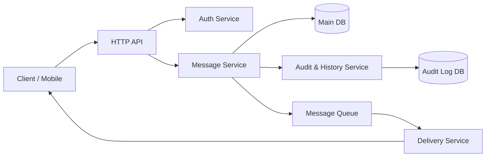
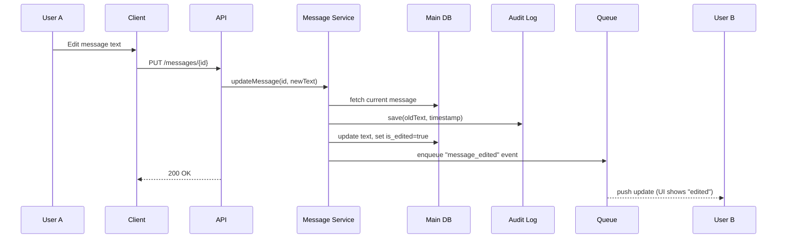
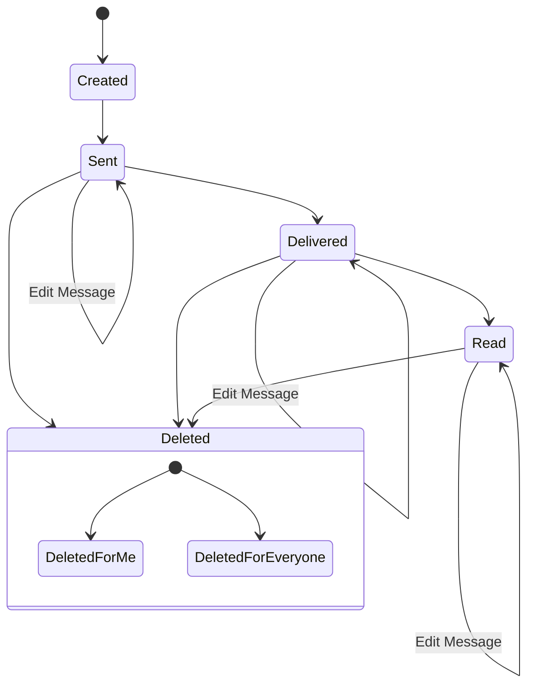

# Laboratory Work 1
**Course:** Software Design and Documentation
**Student:** Каріна Рекул, [Твоя група]
**Variant:** 6 — Message Editing & Deletion

## Context
The goal is to design a messenger system that supports basic messaging capabilities with an emphasis on **consistency and auditability**. The system must allow users to edit sent messages and delete messages ("for me" vs "for everyone").

---

## Part 1 — Component Diagram (30%)

---

## Part 2 — Sequence Diagram (25%)

**Scenario:** User A edits an already sent message.

---

## Part 3 — State Diagram (20%)

**Object:** `Message`

---

## Part 4 — ADR (Architecture Decision Record) (25%)

# ADR-001: Soft Deletion and Immutable Audit Trail for Messages

## Status
Accepted

## Context
Users require the ability to edit and delete messages. We need to decide whether to physically modify/remove records in the database or keep a history of all changes.

## Decision
We will implement **Soft Delete** for message removal and an **Append-Only Audit Log** for message edits.
1. When a user deletes a message, the database record is not dropped. Instead, a boolean flag is set.
2. When a user edits a message, the `Main DB` gets the new text, while the original text is moved to an `Audit Log DB`.

## Consequences
+ **Pros:** Preserves data integrity, supports future moderation features.
- **Cons:** Increases database storage size.
